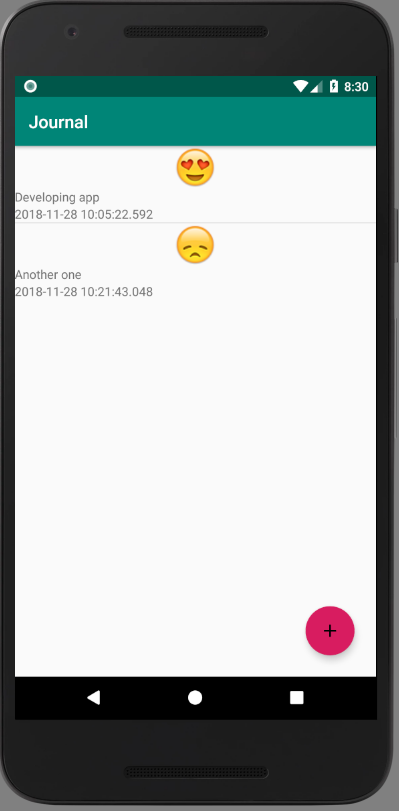
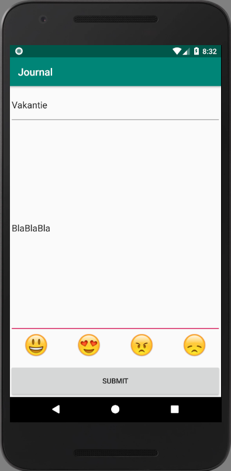
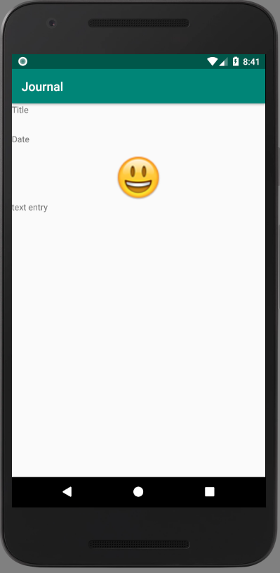

# Journal

Sjoerd Terpstra, 11251980
Minor programmeren, App Studio
28-11-2018

This app implements a journal. The user can create an entry an choose a mood represented by four different smileys. At the home screen it shows all entries. The user can delete an entry by using a long click on the item.

## Screenshots

